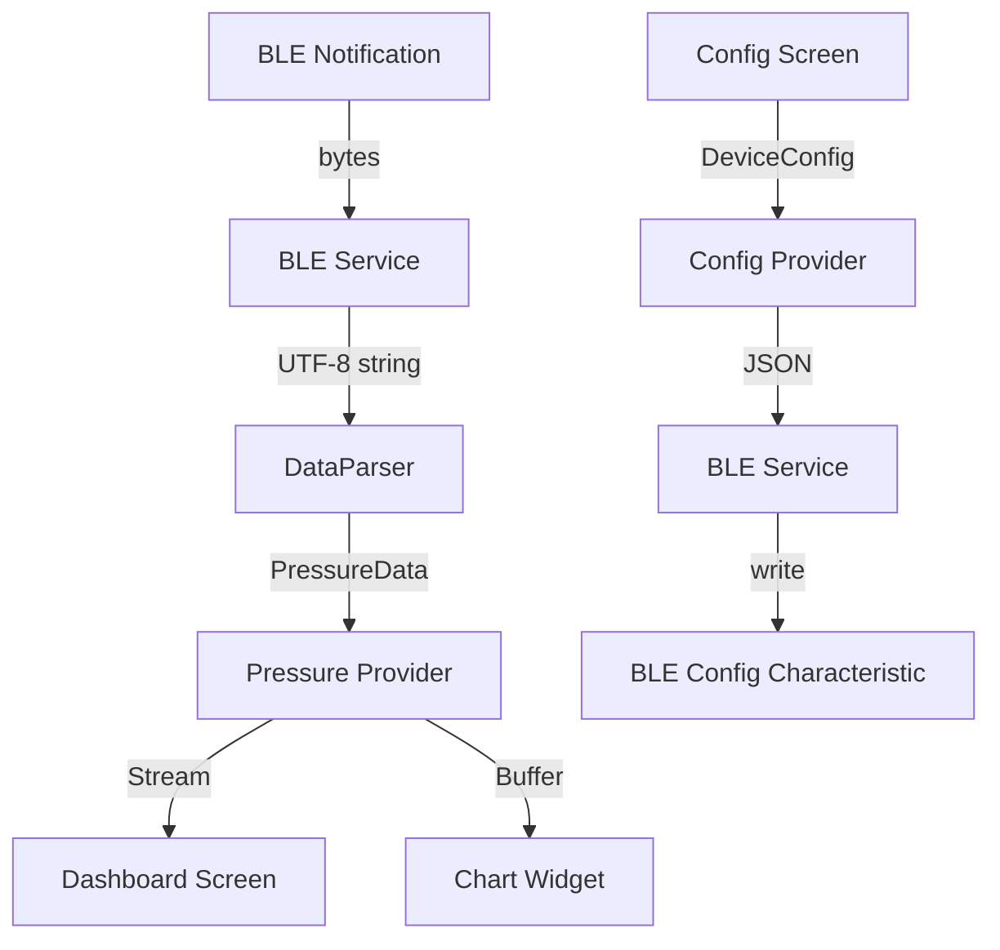

# System Architecture — ESP Fly-in-Peace

> Last updated: 2026-02-13

## 1. High-Level Overview

```
┌─────────────────────┐          BLE (LK8EX1 @ 4 Hz)          ┌──────────────┐
│   ESP32-C3 Device   │ ─────────────────────────────────────► │   XCTrack    │
│                     │                                        │   (Android)  │
│  ┌───────────────┐  │          BLE (Config/Debug)            └──────────────┘
│  │  MS5611 (I2C) │  │ ◄─────────────────────────────────────►┌──────────────┐
│  │  Kalman Filter│  │                                        │  Mobile App  │
│  │  NimBLE Stack │  │                                        │  (Flutter)   │
│  │  FreeRTOS     │  │                                        │  Android     │
│  │  NVS Config   │  │                                        └──────────────┘
│  │  RGB LED      │  │
│  └───────────────┘  │
└─────────────────────┘
```

The system consists of three parts:

1. **ESP32-C3 Device** — Firmware running on an ESP32-C3 microcontroller. Reads a barometric pressure sensor, filters the data, and transmits via BLE.
2. **XCTrack** — Third-party Android flight instrument app. Receives LK8EX1 sentences over BLE SPP for vario and altitude display.
3. **Mobile App** — Companion Flutter app for device configuration, real-time data visualization, and debugging.

## 2. Firmware Architecture

### 2.1 Layer Diagram

```
┌──────────────────────────────────────────────────────┐
│                  Application Layer                    │
│  ┌──────────┐  ┌──────────┐  ┌──────────┐           │
│  │  main.c  │  │  config  │  │  power   │           │
│  └────┬─────┘  └────┬─────┘  └────┬─────┘           │
│       │              │              │                 │
├───────┼──────────────┼──────────────┼─────────────────┤
│       │         Service Layer       │                 │
│  ┌────┴─────┐  ┌────┴─────┐  ┌─────┴────┐           │
│  │   BLE    │  │ Protocol │  │   LED    │           │
│  │ Service  │  │ (LK8EX1) │  │ Manager  │           │
│  └────┬─────┘  └────┬─────┘  └──────────┘           │
│       │              │                                │
├───────┼──────────────┼────────────────────────────────┤
│       │         Processing Layer                      │
│       │         ┌────┴─────┐                          │
│       │         │  Kalman  │                          │
│       │         │  Filter  │                          │
│       │         └────┬─────┘                          │
│       │              │                                │
├───────┼──────────────┼────────────────────────────────┤
│       │          HAL Layer                            │
│       │         ┌────┴─────┐                          │
│       │         │  Sensor  │                          │
│       │         │   HAL    │                          │
│       │         └────┬─────┘                          │
│       │              │                                │
├───────┼──────────────┼────────────────────────────────┤
│  ESP-IDF │     I2C Driver  │  NimBLE  │  NVS  │ GPIO │
└──────────┴─────────────────┴──────────┴───────┴──────┘
```

### 2.2 Components

| Component | Responsibility | Key Files |
|-----------|---------------|-----------|
| **sensor** | Sensor HAL + MS5611 I2C driver | `sensor_api.h`, `ms5611.c`, `sensor_i2c.c` |
| **filter** | 2-state Kalman filter (pressure + vario) | `filter_api.h`, `filter.c` |
| **protocol** | LK8EX1 sentence formatter | `protocol_api.h`, `protocol.c` |
| **ble** | NimBLE BLE stack, SPP + Config services | `ble_api.h`, `ble_spp.c`, `ble_config_svc.c` |
| **config** | NVS configuration manager | `config_api.h`, `config.c` |
| **led** | WS2812 RGB LED status indicator | `led_api.h`, `led.c` |
| **power** | Power management, battery monitoring | `power_api.h`, `power.c` |

### 2.3 Data Flow


### 2.4 FreeRTOS Tasks

```mermaid
gantt
    title Task Timing (simplified, 1 second window)
    dateFormat X
    axisFormat %L ms
    section Sensor (10 Hz)
    Read+Filter :a1, 0, 10
    Read+Filter :a2, 100, 10
    Read+Filter :a3, 200, 10
    Read+Filter :a4, 300, 10
    Read+Filter :a5, 400, 10
    Read+Filter :a6, 500, 10
    Read+Filter :a7, 600, 10
    Read+Filter :a8, 700, 10
    Read+Filter :a9, 800, 10
    Read+Filter :a10, 900, 10
    section BLE (4 Hz)
    Format+Send :b1, 0, 5
    Format+Send :b2, 250, 5
    Format+Send :b3, 500, 5
    Format+Send :b4, 750, 5
    section LED (10 Hz)
    Update :c1, 0, 1
    Update :c2, 100, 1
```



| Task | Priority | Stack | Rate | Description |
|------|----------|-------|------|-------------|
| `sensor_task` | 5 (High) | 4096 B | 10 Hz | Read MS5611, Kalman update |
| `ble_task` | 3 (Normal) | 4096 B | 4 Hz | Format LK8EX1, BLE notify |
| `config_task` | 2 (Low) | 2048 B | Event | Handle config changes |
| `led_task` | 1 (Lowest) | 2048 B | 10 Hz | LED pattern update |

## 3. Mobile App Architecture

### 3.1 Layer Diagram

```
┌─────────────────────────────────────────┐
│              Presentation               │
│  ┌─────────┐  ┌──────────┐  ┌────────┐ │
│  │  Home/  │  │Dashboard │  │ Config │ │
│  │  Scan   │  │  Screen  │  │ Screen │ │
│  └────┬────┘  └────┬─────┘  └───┬────┘ │
├───────┼─────────────┼────────────┼──────┤
│       │       State Management   │      │
│  ┌────┴──────────┐  ┌───────────┴───┐  │
│  │  BLE Provider │  │Config Provider│  │
│  │  Pressure Prov│  │Settings Prov  │  │
│  └────┬──────────┘  └───────────┬───┘  │
├───────┼──────────────────────────┼──────┤
│       │        Services          │      │
│  ┌────┴─────┐  ┌────────────────┴──┐   │
│  │BLE Service│  │  Data Parser     │   │
│  │          │  │  Config Service   │   │
│  └────┬─────┘  └──────────────────┘   │
├───────┼────────────────────────────────┤
│       │      flutter_reactive_ble      │
│       │          (BLE Plugin)          │
└───────┼────────────────────────────────┘
        │
    BLE Radio
```

### 3.2 Technology Stack

| Layer | Technology |
|-------|-----------|
| UI Framework | Flutter |
| Language | Dart |
| State Management | Riverpod |
| BLE Communication | flutter_reactive_ble |
| Charts | fl_chart |
| Target Platform | Android (API 21+) |

### 3.3 Data Flow



## 4. Communication Protocol

### 4.1 BLE Services

See [ble_protocol.md](ble_protocol.md) for full specification.

| Service | Purpose | Data rate |
|---------|---------|-----------|
| SPP | LK8EX1 streaming | 4 Hz (notifications) |
| Config | Device settings | On-demand (read/write) |

### 4.2 Data Format

LK8EX1 sentence — see [lk8ex1_protocol.md](lk8ex1_protocol.md) for full specification.

## 5. Hardware

| Component | Specification |
|-----------|--------------|
| MCU | ESP32-C3 (RISC-V, 160 MHz, 400 KB SRAM) |
| Dev Board | ESP32-C3-DevKitC-02 v1.1 |
| Pressure Sensor | MS5611 (I2C, 0x77) |
| LED | WS2812 RGB (GPIO 8) |
| I2C Pins | SDA=GPIO 6, SCL=GPIO 7 |
| BLE | BLE 5.0 (NimBLE stack) |

## 6. Key Design Decisions

See [PRE-PROMPT.md](../PRE-PROMPT.md) Section 12 — Decision Log for the full list.

Key architectural choices:
- **Sensor HAL**: Abstracted via function pointers to support future sensors (BMP390)
- **Kalman at 10 Hz, BLE at 4 Hz**: Higher filter rate produces better vario estimation
- **NimBLE over Bluedroid**: Lower memory, BLE-only (no Classic BT needed)
- **Static allocation**: Preferred over dynamic for embedded reliability
- **Riverpod for state**: Modern, testable, good fit for BLE data streams

---

*End of Architecture Document*
