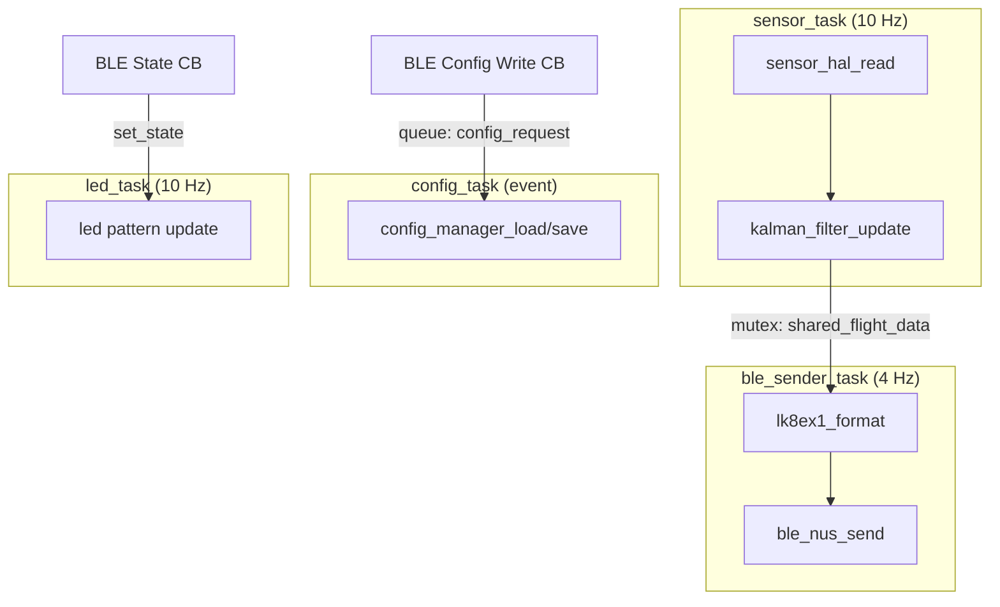
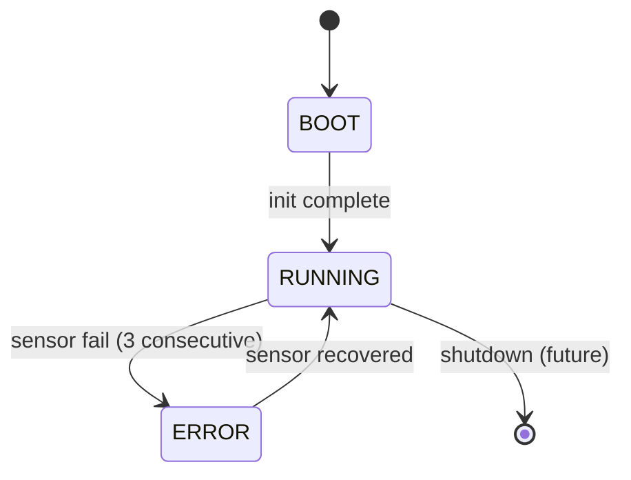
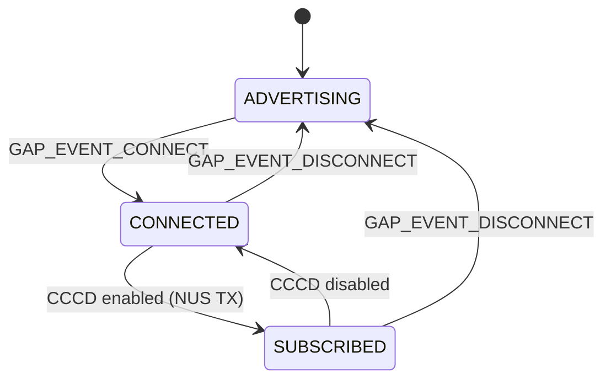
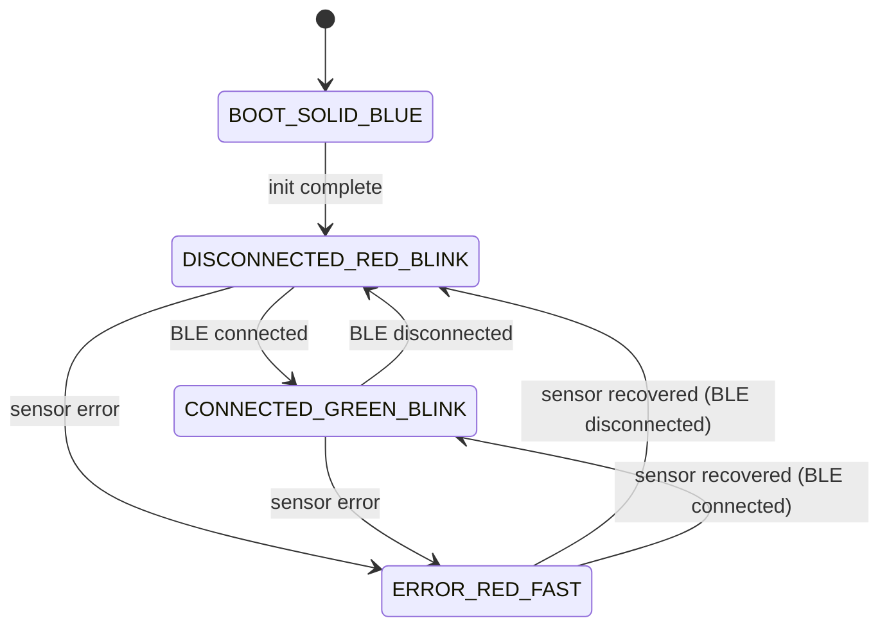

# Firmware Architecture — ESP Fly-in-Peace

> Last updated: 2026-02-16  
> Phase 1 — Software Architecture Design

---

## Table of Contents

1. [High-Level Overview](#1-high-level-overview)
2. [Layer Architecture](#2-layer-architecture)
3. [Component Catalog](#3-component-catalog)
4. [Component Interface Contracts (C API)](#4-component-interface-contracts-c-api)
5. [FreeRTOS Task Model](#5-freertos-task-model)
6. [Inter-Task Communication](#6-inter-task-communication)
7. [Data Flow Pipeline](#7-data-flow-pipeline)
8. [State Machines](#8-state-machines)
9. [Resource Budget](#9-resource-budget)
10. [Error Handling Strategy](#10-error-handling-strategy)
11. [Hardware Mapping](#11-hardware-mapping)

---

## 1. High-Level Overview

```
┌─────────────────────────┐        BLE NUS (LK8EX1 @ 4 Hz)        ┌──────────────┐
│    ESP32-C3 Device      │ ──────────────────────────────────────► │   XCTrack    │
│                         │                                        │   (Android)  │
│  ┌───────────────────┐  │        BLE Config Service (GATT)       └──────────────┘
│  │  MS5611 (I2C)     │  │ ◄────────────────────────────────────► ┌──────────────┐
│  │  Kalman Filter    │  │                                        │  Mobile App  │
│  │  NimBLE Stack     │  │                                        │  (Flutter)   │
│  │  FreeRTOS (4 tasks│) │                                        └──────────────┘
│  │  NVS Config       │  │
│  │  WS2812 RGB LED   │  │
│  └───────────────────┘  │
└─────────────────────────┘
```

The firmware reads barometric pressure from an MS5611 sensor at 10 Hz, applies a 2-state
Kalman filter to derive altitude and vertical speed (vario), formats the data as LK8EX1
NMEA sentences, and transmits them at 4 Hz over BLE NUS notifications.

Three external actors interact with the device:
- **XCTrack** — receives LK8EX1 via BLE NUS TX (notify). Read-only.
- **Mobile App** — receives LK8EX1 via BLE NUS TX, reads/writes config via Config Service GATT.
- **Developer** — serial monitor for debug logs (ESP_LOGx).

---

## 2. Layer Architecture

Dependencies point strictly **downward**. No layer may reference a layer above it.

```
┌──────────────────────────────────────────────────────────────────┐
│                       Application Layer                          │
│  ┌──────────┐  ┌───────────────┐  ┌──────────────┐              │
│  │  main.c  │  │ config_manager│  │ power_manager│              │
│  └────┬─────┘  └───────┬───────┘  └──────┬───────┘              │
│       │                │                  │                      │
├───────┼────────────────┼──────────────────┼──────────────────────┤
│       │           Service Layer           │                      │
│  ┌────┴─────┐  ┌──────┴───────┐  ┌───────┴──────┐               │
│  │ ble_nus  │  │   lk8ex1     │  │ led_indicator│               │
│  └────┬─────┘  └──────┬───────┘  └──────────────┘               │
│       │               │                                          │
├───────┼───────────────┼──────────────────────────────────────────┤
│       │          Processing Layer                                │
│       │          ┌────┴──────┐                                   │
│       │          │  kalman   │                                   │
│       │          │  _filter  │                                   │
│       │          └────┬──────┘                                   │
│       │               │                                          │
├───────┼───────────────┼──────────────────────────────────────────┤
│       │           HAL Layer                                      │
│       │          ┌────┴──────┐                                   │
│       │          │ sensor_hal│                                   │
│       │          │ sensor_   │                                   │
│       │          │ ms5611    │                                   │
│       │          └────┬──────┘                                   │
│       │               │                                          │
├───────┼───────────────┼──────────────────────────────────────────┤
│   ESP-IDF Platform    │                                          │
│  NimBLE │ I2C Driver │ RMT │ NVS │ GPIO │ FreeRTOS │ PM        │
└─────────┴────────────┴─────┴─────┴──────┴──────────┴────────────┘
```

| Layer | Responsibility | Testability |
|-------|---------------|-------------|
| **Application** | System startup, task orchestration, config management | Integration tests on target |
| **Service** | BLE communication, protocol formatting, LED patterns | Partial (lk8ex1 host-testable) |
| **Processing** | Kalman filter math | Fully host-testable (Ceedling) |
| **HAL** | Sensor abstraction, I2C communication | Mockable interface for host tests |
| **ESP-IDF Platform** | Hardware drivers, RTOS kernel | Not tested directly |

---

## 3. Component Catalog

```
micro/components/
├── sensor_hal/            # Sensor abstraction layer (compile-time dispatch via Kconfig)
├── sensor_ms5611/         # MS5611 I2C driver (selected via CONFIG_SENSOR_MS5611)
├── sensor_bmp390/         # BMP390 I2C driver (selected via CONFIG_SENSOR_BMP390)
├── kalman_filter/         # 2-state Kalman filter (altitude + vario)
├── lk8ex1/                # LK8EX1 NMEA sentence formatter + checksum
├── ble_nus/               # NimBLE BLE stack: NUS + Config GATT services
├── led_indicator/         # WS2812 RGB LED state machine via RMT
├── config_manager/        # NVS configuration read/write with defaults
└── power_manager/         # Light-sleep, power gating, battery monitor
```

| Component | Layer | Dependencies | FreeRTOS Primitives Used |
|-----------|-------|-------------|---------------------------|
| `sensor_hal` | HAL | Selected driver (`sensor_ms5611` or `sensor_bmp390`) | — |
| `sensor_ms5611` | HAL | `sensor_hal`, ESP-IDF I2C driver | — |
| `sensor_bmp390` | HAL | `sensor_hal`, ESP-IDF I2C driver | — |
| `kalman_filter` | Processing | (none — pure math) | — |
| `lk8ex1` | Service | (none — pure formatting) | — |
| `ble_nus` | Service | ESP-IDF NimBLE | Task (NimBLE host), queue |
| `led_indicator` | Service | ESP-IDF RMT driver | Task, timer |
| `config_manager` | Application | ESP-IDF NVS | Mutex |
| `power_manager` | Application | ESP-IDF PM, GPIO | — |

---

## 4. Component Interface Contracts (C API)

### 4.1 sensor_hal — Sensor Abstraction (Compile-Time Selection)

Defines a hardware-independent API for pressure/temperature sensors.
The active sensor driver (MS5611 or BMP390) is selected **at compile time** via Kconfig
(`menuconfig`). This avoids runtime function-pointer overhead and ensures only the
selected driver is compiled into the binary.

#### Kconfig Selection Mechanism

```kconfig
# sensor_hal/Kconfig
choice SENSOR_DRIVER
    prompt "Pressure sensor driver"
    default SENSOR_MS5611
    help
        Select the barometric pressure sensor connected to the I2C bus.

    config SENSOR_MS5611
        bool "MS5611"
        help
            TE Connectivity MS5611 barometric pressure sensor.
            I2C address: 0x77 (CSB low) or 0x76 (CSB high).
            Resolution: 24-bit, accuracy ±1.5 mbar.

    config SENSOR_BMP390
        bool "BMP390"
        help
            Bosch BMP390 barometric pressure sensor.
            I2C address: 0x77 (SDO low) or 0x76 (SDO high).
            Resolution: 24-bit, accuracy ±0.5 hPa. Lower noise than MS5611.
endchoice
```

#### Public API (sensor_hal.h)

```c
// sensor_hal.h — Uniform API, resolved at compile time

#include <esp_err.h>
#include <stdint.h>

/// Sensor output data (common to all drivers)
typedef struct sensor_data_s
{
    int32_t pressure_pa;       // Pressure in Pascals (e.g., 101325)
    int32_t temperature_mc;    // Temperature in milli-Celsius (e.g., 23500 = 23.5°C)
    int64_t timestamp_us;      // Microsecond timestamp (esp_timer_get_time)
} sensor_data_t;

/// Initialize the selected sensor driver. Called once at startup.
esp_err_t sensor_hal_init(void);

/// Read compensated pressure and temperature from the sensor.
/// Blocks for the sensor's conversion time (~10-20 ms depending on driver/OSR).
esp_err_t sensor_hal_read(sensor_data_t *out);

/// Deinitialize the sensor. Release I2C bus, power down.
esp_err_t sensor_hal_deinit(void);

/// Return a human-readable name of the active sensor (e.g., "MS5611", "BMP390").
const char *sensor_hal_get_name(void);
```

#### Compile-Time Dispatch (sensor_hal.c)

```c
// sensor_hal.c — Thin dispatch layer

#include "sensor_hal.h"
#include "sdkconfig.h"

#if defined(CONFIG_SENSOR_MS5611)
    #include "sensor_ms5611.h"
    static sensor_ms5611_t s_sensor;
#elif defined(CONFIG_SENSOR_BMP390)
    #include "sensor_bmp390.h"
    static sensor_bmp390_t s_sensor;
#else
    #error "No sensor driver selected. Run idf.py menuconfig → Sensor driver."
#endif

esp_err_t sensor_hal_init(void)
{
#if defined(CONFIG_SENSOR_MS5611)
    static const sensor_ms5611_cfg_t cfg = { ... };
    return sensor_ms5611_init(&s_sensor, &cfg);
#elif defined(CONFIG_SENSOR_BMP390)
    static const sensor_bmp390_cfg_t cfg = { ... };
    return sensor_bmp390_init(&s_sensor, &cfg);
#endif
}

// sensor_hal_read() and sensor_hal_deinit() follow the same pattern.
```

#### CMakeLists.txt Conditional Compilation

```cmake
# sensor_hal/CMakeLists.txt
set(SRCS "src/sensor_hal.c")
set(REQUIRES "")

if(CONFIG_SENSOR_MS5611)
    list(APPEND REQUIRES sensor_ms5611)
elseif(CONFIG_SENSOR_BMP390)
    list(APPEND REQUIRES sensor_bmp390)
endif()

idf_component_register(
    SRCS ${SRCS}
    INCLUDE_DIRS "include"
    REQUIRES ${REQUIRES}
)
```

**Contract**:
- `sensor_hal_init()` — configures I2C, reads calibration data. Called once from `app_main()`.
- `sensor_hal_read()` — performs a complete read cycle (trigger → wait → read → compensate). Blocks for the sensor's conversion time.
- `sensor_hal_deinit()` — releases I2C bus, powers down sensor.
- All functions return `ESP_OK` on success, appropriate `esp_err_t` on failure.
- `sensor_hal_read()` populates `sensor_data_t` with compensated values. On error, `out` is not modified.
- Only the selected driver is compiled. No unused code in the binary.
- **Adding a new sensor**: create `sensor_<name>/`, add a `config SENSOR_<NAME>` entry to the Kconfig `choice`, and add the `#elif` branch in `sensor_hal.c`.

---

### 4.2 sensor_ms5611 — MS5611 I2C Driver

Barometric pressure sensor driver. Selected via `CONFIG_SENSOR_MS5611` in Kconfig.
Called exclusively through `sensor_hal` — never directly by application code.

```c
// sensor_ms5611.h

typedef struct sensor_ms5611_cfg_s
{
    i2c_port_t i2c_port;       // I2C port number (I2C_NUM_0)
    uint8_t    i2c_addr;       // I2C address (0x77 or 0x76, CSB pin)
    uint8_t    osr;            // Oversampling ratio: 256, 512, 1024, 2048, 4096
} sensor_ms5611_cfg_t;

typedef struct sensor_ms5611_s
{
    const sensor_ms5611_cfg_t *cfg;
    uint16_t calibration[6];   // PROM calibration coefficients C1..C6
    uint32_t raw_pressure;
    uint32_t raw_temperature;
} sensor_ms5611_t;

esp_err_t sensor_ms5611_init(sensor_ms5611_t *self, const sensor_ms5611_cfg_t *cfg);
esp_err_t sensor_ms5611_read(sensor_ms5611_t *self, sensor_data_t *out);
esp_err_t sensor_ms5611_deinit(sensor_ms5611_t *self);
```

**Contract**:
- `init()` reads PROM calibration coefficients (C1–C6) and validates CRC.
- `read()` triggers D1 (pressure) and D2 (temperature) conversions, reads ADC values, and applies second-order compensation per datasheet.
- Conversion time depends on OSR: 256→0.6 ms, 4096→9.04 ms. Default OSR = 4096 for best resolution.

---

### 4.3 sensor_bmp390 — BMP390 I2C Driver

Barometric pressure sensor driver. Selected via `CONFIG_SENSOR_BMP390` in Kconfig.
Called exclusively through `sensor_hal` — never directly by application code.

```c
// sensor_bmp390.h

typedef struct sensor_bmp390_cfg_s
{
    i2c_port_t i2c_port;       // I2C port number (I2C_NUM_0)
    uint8_t    i2c_addr;       // I2C address (0x77 SDO=GND, 0x76 SDO=VCC)
    uint8_t    osr_p;          // Pressure oversampling: 1x, 2x, 4x, 8x, 16x, 32x
    uint8_t    osr_t;          // Temperature oversampling: 1x, 2x, 4x, 8x, 16x, 32x
    uint8_t    odr;            // Output data rate divisor
    uint8_t    iir_filter;     // IIR filter coefficient: 0 (off), 1, 3, 7, 15, 31, 63, 127
} sensor_bmp390_cfg_t;

typedef struct sensor_bmp390_s
{
    const sensor_bmp390_cfg_t *cfg;
    // Trimming coefficients (11 values from NVM)
    float par_t1, par_t2, par_t3;
    float par_p1, par_p2, par_p3, par_p4;
    float par_p5, par_p6, par_p7, par_p8;
    float par_p9, par_p10, par_p11;
    uint32_t raw_pressure;
    uint32_t raw_temperature;
} sensor_bmp390_t;

esp_err_t sensor_bmp390_init(sensor_bmp390_t *self, const sensor_bmp390_cfg_t *cfg);
esp_err_t sensor_bmp390_read(sensor_bmp390_t *self, sensor_data_t *out);
esp_err_t sensor_bmp390_deinit(sensor_bmp390_t *self);
```

**Contract**:
- `init()` reads trimming coefficients from NVM, validates chip ID (`0x60`), configures OSR/ODR/IIR.
- `read()` triggers forced measurement, waits for data ready, reads raw P+T, applies compensation per Bosch datasheet.
- Conversion time depends on OSR: ~5 ms (1x) to ~40 ms (32x). Default OSR_P = 8x, OSR_T = 1x for best accuracy/speed balance.
- IIR filter coefficient: default 3 (light low-pass filtering).

**BMP390 vs MS5611 comparison** (for driver development reference):

| Feature | MS5611 | BMP390 |
|---------|--------|--------|
| Pressure range | 10–1200 mbar | 300–1250 hPa |
| Absolute accuracy | ±1.5 mbar | ±0.5 hPa |
| Relative accuracy | ±0.5 mbar | ±0.03 hPa |
| Resolution | 24-bit ADC | 24-bit ADC |
| I2C address | 0x77/0x76 | 0x77/0x76 |
| Calibration | 6 × PROM coefficients | 11 × NVM trimming |
| Compensation | Integer math (datasheet) | Float math (Bosch API) |
| Built-in IIR filter | No | Yes |
| FIFO | No | Yes (72 frames, not used in MVP) |

---

### 4.4 kalman_filter — 2-State Kalman Filter

Pure math component. No ESP-IDF dependencies. Fully host-testable.

```c
// kalman_filter.h

typedef struct kalman_cfg_s
{
    float q_altitude;          // Process noise for altitude (default: 0.01)
    float q_vario;             // Process noise for vario (default: 0.01)
    float r_measurement;       // Measurement noise (default: 0.5)
} kalman_cfg_t;

typedef struct kalman_state_s
{
    float altitude_m;          // Estimated altitude in meters
    float vario_ms;            // Estimated vertical speed in m/s
    float p[2][2];             // Error covariance matrix (2x2)
    int64_t last_timestamp_us; // Last update timestamp
    bool initialized;          // First sample flag
} kalman_state_t;

esp_err_t kalman_filter_init(kalman_state_t *state, const kalman_cfg_t *cfg);
esp_err_t kalman_filter_update(kalman_state_t *state, const kalman_cfg_t *cfg,
                               float pressure_pa, int64_t timestamp_us);
esp_err_t kalman_filter_reset(kalman_state_t *state);
```

**Contract**:
- `init()` sets initial state: altitude = 0, vario = 0, covariance = identity.
- `update()` performs predict + correct step. Converts pressure to altitude internally using barometric formula. Computes dt from timestamps.
- If `!initialized`, first call sets altitude from pressure and marks initialized (no predict step).
- `reset()` clears state (e.g., after sensor error or config change).
- All math uses `float` (ESP32-C3 has no FPU; `float` is faster than `double` in software).

**Barometric formula** (ISA standard atmosphere):
$$h = 44330 \times \left(1 - \left(\frac{P}{P_0}\right)^{0.1903}\right)$$
Where $P_0 = 101325$ Pa (sea level reference).

---

### 4.5 lk8ex1 — LK8EX1 NMEA Formatter

Pure C formatting. No ESP-IDF dependencies. Fully host-testable.

```c
// lk8ex1.h

typedef struct lk8ex1_data_s
{
    int32_t pressure_pa;       // Pressure in Pascals (e.g., 101325)
    int32_t altitude_m;        // Altitude in meters (99999 = not available)
    int32_t vario_cms;         // Vertical speed in cm/s (e.g., 50 = 0.50 m/s)
    int32_t temperature_dc;    // Temperature in °C × 10 (e.g., 235 = 23.5°C)
    int32_t battery_mv;        // Battery voltage mV (999 = not available)
} lk8ex1_data_t;

esp_err_t lk8ex1_format(const lk8ex1_data_t *data, char *buffer, size_t buffer_size);
uint8_t   lk8ex1_checksum(const char *sentence, size_t len);
bool      lk8ex1_validate(const char *sentence);
```

**Contract**:
- `format()` writes `$LK8EX1,pressure,altitude,vario,temperature,battery*XX\r\n\0` into buffer.
- Returns `ESP_ERR_INVALID_SIZE` if buffer is too small (minimum: `LK8EX1_MAX_SENTENCE_LEN` = 64 bytes).
- `checksum()` computes XOR of chars between `$` and `*` (exclusive), returns as `uint8_t`.
- `validate()` parses sentence, computes checksum, compares with embedded checksum.
- All integer formatting; no floating-point operations.

**Example output**: `$LK8EX1,101325,99999,50,235,999*18\r\n`

---

### 4.6 ble_nus — BLE Nordic UART Service

Manages the NimBLE stack, GAP advertising, NUS GATT service, and Config GATT service.

```c
// ble_nus.h

typedef void (*ble_nus_rx_cb_t)(const uint8_t *data, uint16_t len);
typedef void (*ble_nus_state_cb_t)(bool connected, uint16_t conn_handle);

typedef struct ble_nus_cfg_s
{
    const char *device_name;       // BLE device name (default: "FlyInPeace")
    uint16_t    adv_interval_ms;   // Advertising interval (default: 100 ms)
} ble_nus_cfg_t;

esp_err_t ble_nus_init(const ble_nus_cfg_t *cfg);
esp_err_t ble_nus_deinit(void);
esp_err_t ble_nus_send(const uint8_t *data, uint16_t len);
bool      ble_nus_is_connected(void);
void      ble_nus_register_rx_callback(ble_nus_rx_cb_t callback);
void      ble_nus_register_state_callback(ble_nus_state_cb_t callback);
```

**Contract**:
- `init()` initializes NimBLE host, registers NUS + Config GATT services, starts advertising.
- `send()` sends data via NUS TX notification. Returns `ESP_ERR_INVALID_STATE` if not connected or CCCD not subscribed. Thread-safe.
- `is_connected()` returns current connection state. Thread-safe (atomic read).
- Advertising restarts automatically after disconnection.
- MTU negotiation: requests 256 bytes. Fragments data if payload exceeds (MTU - 3).
- NimBLE host task is created internally by `nimble_port_freertos_init()`.

**GATT Services**: See [ble_protocol.md](ble_protocol.md) for UUID table and Config Service specification.

---

### 4.7 led_indicator — RGB LED State Machine

Drives the onboard WS2812 RGB LED via the RMT peripheral to indicate system state.

```c
// led_indicator.h

typedef enum led_state_e
{
    LED_STATE_BOOT,            // Blue solid (during initialization)
    LED_STATE_BLE_DISCONNECTED,// Red blink (100 ms on / 1900 ms off)
    LED_STATE_BLE_CONNECTED,   // Green blink (100 ms on / 4900 ms off)
    LED_STATE_WIFI_ENABLED,    // Blue blink (future, stub in MVP)
    LED_STATE_ERROR,           // Red fast blink (100 ms on / 100 ms off)
} led_state_e;

esp_err_t led_indicator_init(void);
esp_err_t led_indicator_set_state(led_state_e state);
led_state_e led_indicator_get_state(void);
esp_err_t led_indicator_deinit(void);
```

**Contract**:
- `init()` configures RMT channel for WS2812 on GPIO 8. Creates the LED task.
- `set_state()` changes current LED pattern. Thread-safe (queue-based).
- The LED task runs at 10 Hz and updates the LED color/on-off based on current state and elapsed time.
- Pattern definitions are internal (not exposed in API).

---

### 4.8 config_manager — NVS Configuration

Manages persistent device configuration in NVS with type-safe access and defaults.

```c
// config_manager.h

typedef struct device_config_s
{
    uint8_t  sensor_rate_hz;       // Sensor read rate (default: 10)
    uint8_t  ble_tx_rate_hz;       // BLE send rate (default: 4)
    float    kalman_q;             // Kalman process noise (default: 0.01)
    float    kalman_r;             // Kalman measurement noise (default: 0.5)
    char     device_name[21];      // BLE device name (default: "FlyInPeace")
    bool     wifi_enabled;         // WiFi enable flag (default: false)
} device_config_t;

esp_err_t config_manager_init(void);
esp_err_t config_manager_load(device_config_t *config);
esp_err_t config_manager_save(const device_config_t *config);
esp_err_t config_manager_reset_defaults(void);
const device_config_t *config_manager_get_defaults(void);
```

**Contract**:
- `init()` opens NVS namespace `"fip_config"`. If no config exists, writes defaults.
- `load()` reads all config fields from NVS. On any read error, uses default value for that field.
- `save()` validates all fields before writing. Returns `ESP_ERR_INVALID_ARG` if validation fails.
- Thread-safe: internal mutex protects NVS access.
- Validation rules: `sensor_rate_hz` ∈ [1, 100], `ble_tx_rate_hz` ∈ [1, 50], `kalman_q` ∈ [0.001, 10.0], `kalman_r` ∈ [0.01, 100.0], `device_name` length ∈ [1, 20].

---

### 4.9 power_manager — Power Management

Controls light-sleep and peripheral power gating for battery optimization.

```c
// power_manager.h

esp_err_t power_manager_init(void);
esp_err_t power_manager_enable_light_sleep(bool enable);
esp_err_t power_manager_get_battery_mv(uint16_t *battery_mv);
```

**Contract**:
- `init()` configures ESP-IDF power management (`esp_pm_configure`) with `light_sleep_enable`.
- `enable_light_sleep()` dynamically enables/disables automatic light-sleep.
- `get_battery_mv()` reads battery voltage via ADC (or returns 999 if no ADC configured in MVP).
- FreeRTOS tickless idle handles the sleep/wake cycle automatically when PM is enabled.

---

## 5. FreeRTOS Task Model

### 5.1 Task Definitions

| Task | Function | Priority | Stack (bytes) | Rate | Core | Description |
|------|----------|----------|---------------|------|------|-------------|
| `sensor_task` | `sensor_task_fn` | 5 (High) | 4096 | 10 Hz (100 ms) | 0 | Read MS5611, run Kalman update |
| `ble_sender_task` | `ble_sender_task_fn` | 3 (Normal) | 4096 | 4 Hz (250 ms) | 0 | Format LK8EX1, send via BLE NUS TX |
| `led_task` | `led_task_fn` | 1 (Lowest) | 2048 | 10 Hz (100 ms) | 0 | Update WS2812 LED pattern |
| `config_task` | `config_task_fn` | 2 (Low) | 2048 | Event-driven | 0 | Handle config read/write from BLE |
| NimBLE host | (internal) | 4 | 4096 | Event-driven | 0 | NimBLE host processing |

> ESP32-C3 is **single-core** (RISC-V). All tasks share one core.
> Priority range: 0 (idle) to `configMAX_PRIORITIES - 1` (highest).
> FreeRTOS tick rate: 1000 Hz (1 ms resolution).

### 5.2 Task Responsibility Detail

#### sensor_task (Priority 5 — Highest application task)

```
loop (every 100 ms):
    1. sensor_hal_read(&sensor_data)
    2. kalman_filter_update(&state, &cfg, sensor_data.pressure_pa, sensor_data.timestamp_us)
    3. Copy kalman_state to shared_flight_data (protected by mutex)
    4. vTaskDelay(remaining time to hit 100 ms period)
```

This is the highest-priority application task because sensor timing accuracy directly affects Kalman filter quality.

#### ble_sender_task (Priority 3)

```
loop (every 250 ms):
    1. Read shared_flight_data (mutex)
    2. Build lk8ex1_data from flight data + battery + temperature
    3. lk8ex1_format(&data, buffer, sizeof(buffer))
    4. ble_nus_send(buffer, strlen(buffer))
    5. vTaskDelay(remaining time to hit 250 ms period)
```

#### led_task (Priority 1 — Lowest)

```
loop (every 100 ms):
    1. Check ble_nus_is_connected()
    2. Update led_indicator state if connection state changed
    3. led_indicator internal pattern update (on/off timing)
    4. vTaskDelay(100 ms)
```

#### config_task (Priority 2 — Event-driven)

```
loop:
    1. xQueueReceive(config_queue, &request, portMAX_DELAY)  // blocks until event
    2. Switch on request type:
       - CONFIG_READ:  config_manager_load() → send response via BLE Config char
       - CONFIG_WRITE: validate → config_manager_save() → apply → send ack
       - CONFIG_RESET: config_manager_reset_defaults() → restart
```

### 5.3 Task Timing Diagram (1-second window)

```
Time (ms)   0   100  200  300  400  500  600  700  800  900  1000
            │    │    │    │    │    │    │    │    │    │    │
sensor      ██   ██   ██   ██   ██   ██   ██   ██   ██   ██   ██
(10 Hz)     ~10ms each read+filter cycle

ble_sender  ██        ██        ██        ██
(4 Hz)      ~2ms each format+send

led         █    █    █    █    █    █    █    █    █    █    █
(10 Hz)     ~0.5ms pattern eval + RMT write

config      ·····························█·····················
(event)                                  ^-- BLE write event

nimble      ·█··█··█··█··█··█··█··█··█··█··█··█··█··█··█··█··█
(internal)  event-driven, runs between other tasks
```

Legend: `█` = running, `·` = sleeping/waiting, gaps = idle (light-sleep eligible)

### 5.4 Priority Rationale

```
5: sensor_task      — Timing-critical. Jitter in sensor reads degrades Kalman accuracy.
4: NimBLE host      — Must process BLE events promptly for connection stability.
3: ble_sender_task  — Important for data delivery but can tolerate 1-2 ms jitter.
2: config_task      — Infrequent, non-real-time. Can wait for higher-priority tasks.
1: led_task         — Visual feedback only. Lowest priority.
0: IDLE             — FreeRTOS idle task (triggers light-sleep when PM enabled).
```

---

## 6. Inter-Task Communication

### 6.1 Shared Flight Data (Mutex-protected)

The primary data exchange between `sensor_task` and `ble_sender_task` uses a mutex-protected shared structure, not a queue. Rationale: the BLE sender always wants the **latest** data, not queued historical samples.

```c
typedef struct shared_flight_data_s
{
    float    altitude_m;       // From Kalman filter
    float    vario_ms;         // From Kalman filter (m/s)
    int32_t  pressure_pa;      // Last raw pressure
    int32_t  temperature_mc;   // Last raw temperature (milli-Celsius)
    int64_t  timestamp_us;     // Timestamp of last sensor read
    bool     sensor_valid;     // false if last read failed
} shared_flight_data_t;

// Access pattern:
// Writer (sensor_task):   xSemaphoreTake(mutex) → write → xSemaphoreGive(mutex)
// Reader (ble_sender):    xSemaphoreTake(mutex) → copy → xSemaphoreGive(mutex)
```

### 6.2 Config Queue (Event-driven)

```c
typedef enum config_request_type_e
{
    CONFIG_REQUEST_READ,
    CONFIG_REQUEST_WRITE,
    CONFIG_REQUEST_RESET,
} config_request_type_e;

typedef struct config_request_s
{
    config_request_type_e type;
    uint8_t  data[256];        // JSON payload for write requests
    uint16_t data_len;
} config_request_t;

// Queue: xQueueCreate(4, sizeof(config_request_t))
// Producer: BLE Config GATT write callback
// Consumer: config_task
```

### 6.3 LED State (Atomic / Direct Call)

LED state is set via `led_indicator_set_state()` which internally posts to a small queue (depth 1, overwrite mode). The LED task consumes the state and manages the blinking pattern. No mutex needed — the API is designed to be called from any context.

### 6.4 Communication Map



---

## 7. Data Flow Pipeline

### 7.1 End-to-End Data Path

```
  Sensor (MS5611       sensor_task              ble_sender_task           BLE Radio
   or BMP390)    ┌─────────────────────┐    ┌───────────────────────┐    ┌─────────┐
  ┌──────────┐   │                     │    │                       │    │         │
  │          │   │ 1. sensor_hal_read()│    │ 4. Read shared state  │    │ NUS TX  │
  │ I2C bus  ├──►│    (driver selected │    │ 5. Build lk8ex1_data  │    │ notify  │
  │ (0x77)   │   │     at compile time)│    │ 6. lk8ex1_format()    ├───►│ to      │
  └──────────┘   │ 2. Kalman update    │    │ 7. ble_nus_send()     │    │ client  │
                 │    → altitude, vario│    │                       │    │         │
                 └────────┬────────────┘    └───────┬───────────────┘    └─────────┘
                           │                         │
                           │   shared_flight_data    │
                           │  ┌────────────────────┐ │
                           └─►│ altitude_m         ├─┘
                              │ vario_ms           │
                              │ pressure_pa        │
                              │ temperature_mc     │
                              │ timestamp_us       │
                              └────────────────────┘
                                  (mutex-protected)
```

### 7.2 Data types at each stage

| Stage | Data Type | Sample Values |
|-------|-----------|---------------|
| I2C raw ADC | `uint32_t` (24-bit) | MS5611: D1=6465444, D2=8077636; BMP390: similar range |
| Compensated pressure | `int32_t` (Pa) | 101325 |
| Compensated temperature | `int32_t` (milli-°C) | 23500 (= 23.5°C) |
| Kalman altitude | `float` (m) | 452.3 |
| Kalman vario | `float` (m/s) | 0.50 |
| LK8EX1 sentence | `char[64]` | `$LK8EX1,101325,99999,50,235,999*18\r\n` |
| BLE NUS TX | `uint8_t[]` | UTF-8 bytes of sentence |

### 7.3 Timing Budget per Cycle

| Operation | Duration | Frequency |
|-----------|----------|-----------|
| MS5611 D1 conversion (OSR 4096) | 9.04 ms | 10 Hz |
| MS5611 D2 conversion (OSR 4096) | 9.04 ms | 10 Hz |
| I2C read (3 bytes × 2) | ~0.3 ms | 10 Hz |
| MS5611 compensation math | ~0.05 ms | 10 Hz |
| Kalman predict + correct | ~0.02 ms | 10 Hz |
| **Total sensor cycle** | **~18.5 ms** | **10 Hz** |
| LK8EX1 format | ~0.01 ms | 4 Hz |
| BLE NUS send (queue + notify) | ~1 ms | 4 Hz |
| **Total BLE cycle** | **~1 ms** | **4 Hz** |

> The sensor cycle takes ~18.5 ms out of a 100 ms period, leaving **~81.5 ms** for light-sleep per cycle.

---

## 8. State Machines

### 8.1 System State



### 8.2 BLE Connection State



Transitions trigger:
- `ADVERTISING → CONNECTED`: LED state → `LED_STATE_BLE_CONNECTED`
- `CONNECTED → ADVERTISING`: LED state → `LED_STATE_BLE_DISCONNECTED`, restart advertising
- `SUBSCRIBED`: `ble_nus_send()` starts delivering notifications

### 8.3 LED State Machine



| State | Color | Pattern | Timing |
|-------|-------|---------|--------|
| `BOOT` | Blue | Solid | Until init completes |
| `BLE_DISCONNECTED` | Red | Blink | 100 ms ON / 1900 ms OFF |
| `BLE_CONNECTED` | Green | Blink | 100 ms ON / 4900 ms OFF |
| `WIFI_ENABLED` | Blue | Blink | (stub, future) |
| `ERROR` | Red | Fast blink | 100 ms ON / 100 ms OFF |

---

## 9. Resource Budget

### 9.1 RAM Budget (ESP32-C3: ~400 KB SRAM available, ~320 KB usable after ESP-IDF)

| Consumer | Estimated (bytes) | Notes |
|----------|--------------------|-------|
| FreeRTOS heap (default) | ~32,000 | Task stacks, queues, mutexes |
| sensor_task stack | 4,096 | I2C buffers, compensation math |
| ble_sender_task stack | 4,096 | LK8EX1 buffer, BLE API calls |
| led_task stack | 2,048 | RMT buffer, state machine |
| config_task stack | 2,048 | NVS reads, JSON buffer |
| NimBLE host task stack | 4,096 | BLE stack processing |
| NimBLE memory pool | ~16,000 | Connection, advertising, GATT |
| shared_flight_data | 32 | Struct + mutex |
| config_queue | ~1,064 | 4 × 264 bytes |
| RMT LED buffer | ~1,000 | WS2812 encoding (24 bits × 4 bytes) |
| Static buffers | ~512 | LK8EX1 format buffer, misc |
| **Total estimated** | **~67,000** | ~21% of usable RAM |
| **Available for ESP-IDF/NVS** | **~253,000** | WiFi stack (future) needs ~90 KB |

### 9.2 Flash Budget (4 MB flash, custom partition table)

| Partition | Size | Contents |
|-----------|------|----------|
| bootloader | 28 KB | ESP-IDF bootloader |
| partition-table | 4 KB | Partition definitions |
| nvs | 24 KB | NVS key-value storage |
| phy_init | 4 KB | PHY calibration data |
| app | ~1.5 MB | Firmware binary |
| ota_0 | ~1.5 MB | OTA slot (future) |
| **Total** | **4 MB** | |

---

## 10. Error Handling Strategy

### 10.1 General Rules

1. **All public functions return `esp_err_t`** (except trivial getters).
2. **Validate all pointer parameters** at function entry. Return `ESP_ERR_INVALID_ARG` for NULL.
3. **Log every error** with `ESP_LOGE(TAG, "operation failed: %s", esp_err_to_name(ret))`.
4. **Never silently ignore errors**. Propagate up or handle with a recovery strategy.
5. **Use early-return** pattern to avoid deep nesting.

### 10.2 Per-Component Error Strategy

| Component | Error Type | Recovery Action |
|-----------|-----------|-----------------|
| `sensor_ms5611` | I2C NACK/timeout | Retry once. On second failure, return error. After 3 consecutive failures, set `sensor_valid = false` in shared data. |
| `sensor_bmp390` | I2C NACK/timeout | Same strategy as MS5611: retry once, then error. 3 consecutive failures → `sensor_valid = false`. |
| `sensor_bmp390` | Chip ID mismatch | Return `ESP_ERR_NOT_FOUND` on init. Log error with expected vs actual chip ID. |
| `kalman_filter` | Invalid input (NaN, extreme values) | Skip update, keep previous state. Log warning. |
| `lk8ex1` | Buffer too small | Return `ESP_ERR_INVALID_SIZE`. Never write past buffer. |
| `ble_nus` | Send while not connected | Return `ESP_ERR_INVALID_STATE`. Caller skips silently. |
| `ble_nus` | Send while CCCD not subscribed | Return `ESP_ERR_INVALID_STATE`. |
| `config_manager` | NVS read error | Use default value for that field. Log warning. |
| `config_manager` | NVS write error | Return error. Do not apply partial config. |
| `led_indicator` | RMT error | Log error. System continues without LED. Non-critical. |

### 10.3 Watchdog

- FreeRTOS Task Watchdog Timer (TWDT) enabled for `sensor_task` (critical path).
- Timeout: 5 seconds (5× the 1-second budget for 10 Hz reads).
- Feed watchdog at the end of each sensor read cycle.
- Other tasks are not registered with TWDT (non-critical).

---

## 11. Hardware Mapping

### 11.1 ESP32-C3-DevKitC-02 v1.1 Pin Assignment

| GPIO | Function | Peripheral | Notes |
|------|----------|-----------|-------|
| GPIO 6 | I2C SDA | I2C_NUM_0 | Sensor data line (4.7 kΩ pull-up) |
| GPIO 7 | I2C SCL | I2C_NUM_0 | Sensor clock line (4.7 kΩ pull-up) |
| GPIO 8 | WS2812 data | RMT CH0 | Onboard RGB LED |
| GPIO 18 | USB D- | USB-CDC | Serial monitor / flash |
| GPIO 19 | USB D+ | USB-CDC | Serial monitor / flash |

### 11.2 I2C Configuration

| Parameter | Value |
|-----------|-------|
| Port | I2C_NUM_0 |
| SDA | GPIO 6 |
| SCL | GPIO 7 |
| Clock speed | 400 kHz (Fast Mode) |
| Sensor address | 0x77 (MS5611: CSB=GND; BMP390: SDO=GND) |
| Pull-ups | External 4.7 kΩ recommended |

### 11.3 Sensor Wiring (DevKit → Sensor Module)

Both sensors share the same I2C bus and default address (0x77). Only one sensor
is connected at a time. The active driver is selected via `idf.py menuconfig`.

**MS5611 Wiring:**
```
ESP32-C3-DevKitC-02          MS5611 Module
┌──────────────────┐         ┌─────────────┐
│           3V3 ───┼────────►│ VCC         │
│           GND ───┼────────►│ GND         │
│        GPIO 6 ───┼────────►│ SDA         │
│        GPIO 7 ───┼────────►│ SCL         │
│                  │    CSB──┤►GND (0x77)  │
│                  │    PS ──┤►VCC (I2C)   │
└──────────────────┘         └─────────────┘
```

**BMP390 Wiring:**
```
ESP32-C3-DevKitC-02          BMP390 Module
┌──────────────────┐         ┌─────────────┐
│           3V3 ───┼────────►│ VCC         │
│           GND ───┼────────►│ GND         │
│        GPIO 6 ───┼────────►│ SDA         │
│        GPIO 7 ───┼────────►│ SCL         │
│                  │    SDO──┤►GND (0x77)  │
└──────────────────┘         └─────────────┘
```

### 11.4 Sensor Selection (Build-Time)

To switch sensors, run:
```bash
cd micro/
idf.py menuconfig
# Navigate to: Component config → Sensor driver → Pressure sensor driver
# Select MS5611 or BMP390
idf.py build
```

No application code changes are needed. The `sensor_hal` layer dispatches
to the correct driver at compile time.

---

*End of Firmware Architecture Document*
